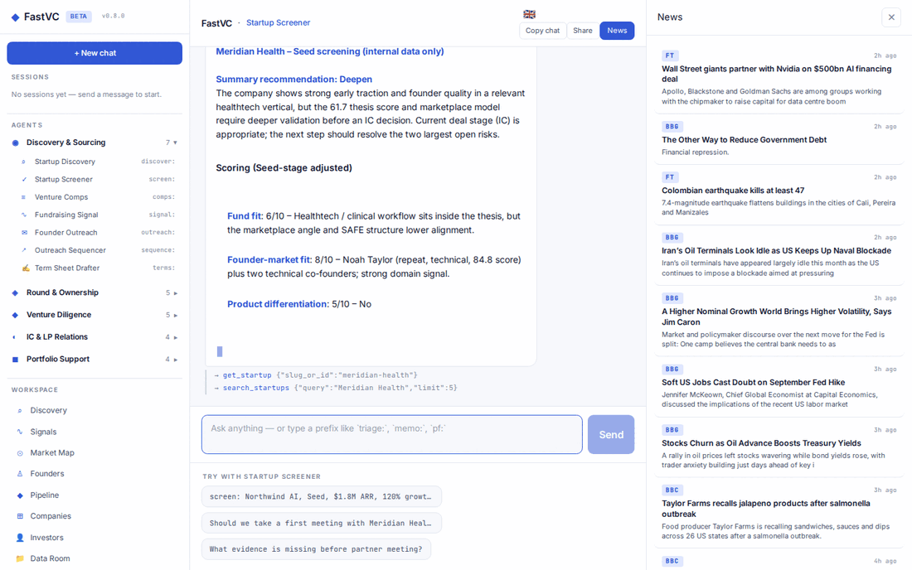

# FastVC

FastVC is an AI workspace for venture investment teams. It adapts the proven
PEHero workflow to a narrower startup-investing domain: thesis-led discovery,
founder and fundraising signals, screening, round construction, diligence,
investment committee, LP relations and portfolio support.

## Product surface

- Startup discovery by thesis, sector, geography, stage and momentum
- Saved searches, alert cadence, company signals, founder profiles and warm paths
- Pipeline from discovered through Series C/growth investment and exit
- 25 venture-native agents across sourcing, ownership, diligence, IC/LP and portfolio
- Round, option-pool, dilution, pro-rata and probability-weighted outcome modelling
- Data-room upload and retrieval with cited source evidence
- LP/family-office CRM and LP-update workflows, without tax functionality
- BYOK adapter stubs for Affinity, Attio, Pipedrive and Brevo
- Provenance-preserving company ingestion from Pappers, Scoris, Companies House,
  INSEE SIRENE, PRH and approved public startup directories
- English plus the PEHero multilingual UI framework

The app uses the `fastvc` OLTP schema and `fastvc_rag` vector schema. Both are
separate from PEHero while using the same PostgreSQL database configured by
`DB_URL`.

## Demo

A validated click-through of the specialist agent squad in conversation — screening
a startup, modelling a round and drafting an IC memo — followed by the Copilot,
discovery, pipeline, analytics, portfolio and other key left-menu workspaces. Capture
failures and visible error states are automatically excluded.



Regenerate any time against a locally running server:

```bash
.venv/bin/python -m playwright install chromium   # one-off
PORT=5059 .venv/bin/python main.py &              # server must be up
DEMO_BASE_URL=http://127.0.0.1:5059 .venv/bin/python scripts/capture_demo.py
bash scripts/build_demo_gif.sh                    # → docs/demo + static copy
```

## Run locally

```bash
cp .env.example .env
python -m venv .venv
.venv/bin/python -m pip install -r requirements.txt
.venv/bin/python -m db.migrate
.venv/bin/python -m scripts.ingest_companies registry --limit 500 --replace
.venv/bin/python main.py
```

Open `http://localhost:5059`. The debug health check is
`http://localhost:5059/app/_debug/ping`.
The container and reverse-proxy health endpoint is
`http://localhost:5059/healthz`.

Required configuration:

- `DB_URL`
- `XAI_API_KEY` for live agent responses
- `APP_SECRET` for sessions and per-user integration-key encryption

Optional configuration includes Tavily or Exa search, Google OAuth, Postmark,
global Affinity/Attio/Pipedrive/Brevo credentials, and the company-data keys in
`.env.example`. CRM adapters validate and store configuration without initiating
live sync. Company-data adapters are live, read-only importers and expose bounded
quality pilots to allowlisted administrators at `/app/integrations`.

## Company data

The default 500-company universe is selected from the existing LT, EE and LV
registry cache shared with PEHero/LiquidRound. Loading it removes the old
synthetic company corpus and its dependent rows, then writes source identifiers,
immutable raw snapshots and annual filing periods. It never fabricates monthly
financials or EBITDA.

```bash
# Inspect the deterministic cohort without writing
.venv/bin/python -m scripts.ingest_companies registry --limit 500 --dry-run

# Explicit destructive cutover from synthetic to registry-backed companies
.venv/bin/python -m scripts.ingest_companies registry --limit 500 --replace

# Free/capped provider comparisons (1–25 records)
.venv/bin/python -m scripts.ingest_companies pilot --provider companies_house --limit 5
.venv/bin/python -m scripts.ingest_companies pilot --provider prh --limit 5
.venv/bin/python -m scripts.ingest_companies pilot --provider scoris --limit 5

# Bulk discovery/upsert. Paid sources should always use an explicit credit cap.
.venv/bin/python -m scripts.ingest_companies backfill --provider sirene --limit 1000
.venv/bin/python -m scripts.ingest_companies backfill --provider companies_house --limit 1000
.venv/bin/python -m scripts.ingest_companies backfill --provider pappers --limit 1000 --max-credits 90

# Approved public portfolio pages; robots.txt is checked before collection
.venv/bin/python -m scripts.ingest_companies directory --source seedcamp --limit 500
.venv/bin/python -m scripts.ingest_companies directory --source startup_wise_guys --limit 500

.venv/bin/python -m scripts.ingest_companies status
```

## Repository map

```text
agents/       25 specialist agent definitions and intent routing
chat/         app workspaces: discovery, signals, pipeline, models, LPs
db/           idempotent fastvc and fastvc_rag schema migrations
prompts/      venture vocabulary plus specialist operating instructions
ingestion/    registry normalization, provider clients, pilots and public directories
synthetic/    legacy deterministic fixtures retained for isolated tests only
tools/        startup, round, diligence, LP and integration tools
landing/      public product pages
tests/        routing, agent construction, tools and UI smoke coverage
```

## Production deployment

FastVC deploys from `main` to Coolify using the repository `Dockerfile`. The
canonical production origin is `https://fastvc.org`, the exposed container
port is `5059`, and the health path is `/healthz`. Set the variables listed in
`.env.coolify.sample`; `docker-entrypoint.sh` runs the idempotent schema
migration before starting the application. An authenticated GitHub Actions
job automatically deploys updates to `main` after CI passes.

## Safety and data boundaries

- Always schema-qualify SQL with `fastvc.*` or `fastvc_rag.*`.
- Treat registry/API records as research inputs whose freshness and source quality
  still need verification before an investment decision.
- Keep evidence and assumptions separate in investment outputs.
- Round and outcome models are illustrative and require legal, tax and fund-model review.
- Provider API keys are encrypted at rest and are never rendered back to the browser.
