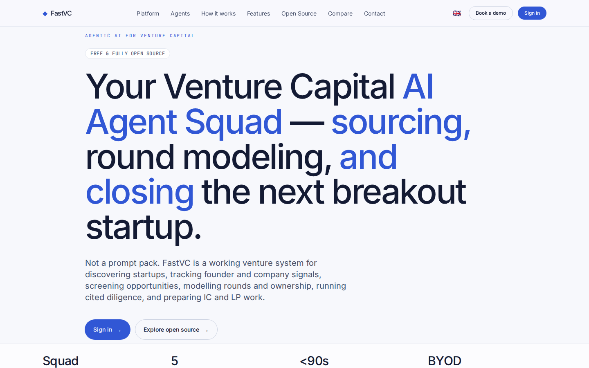
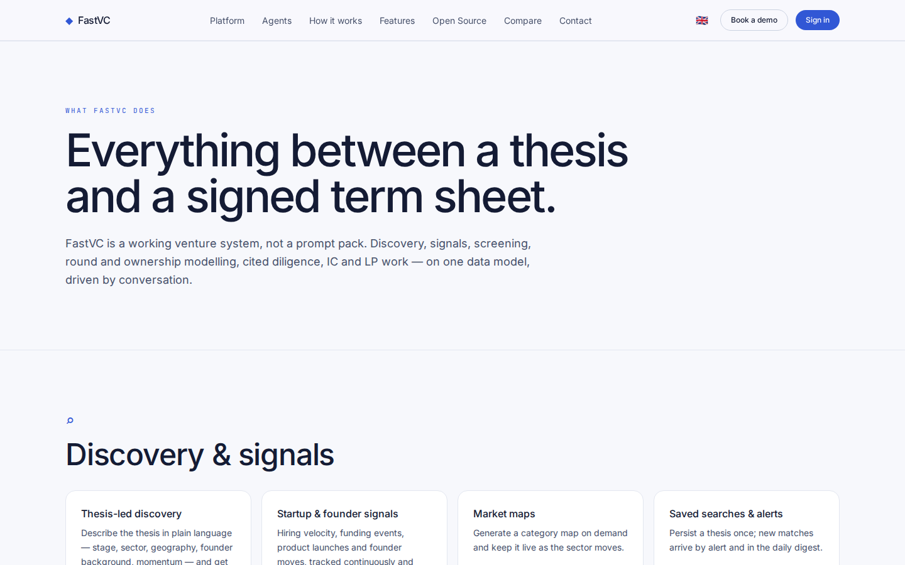
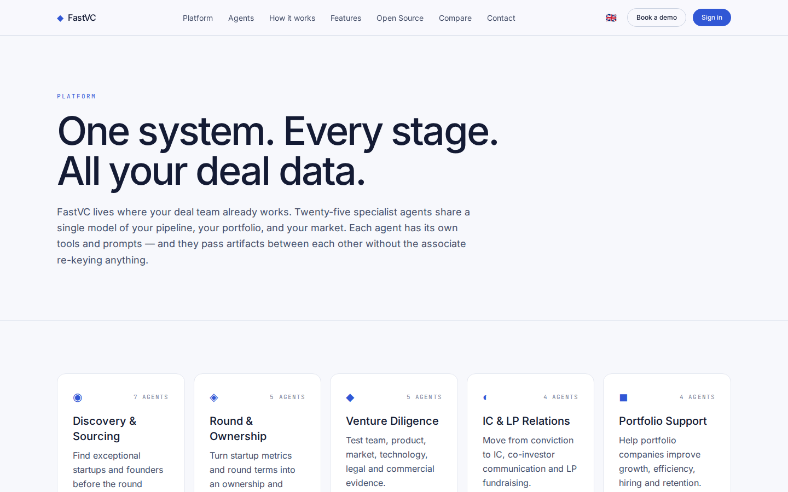
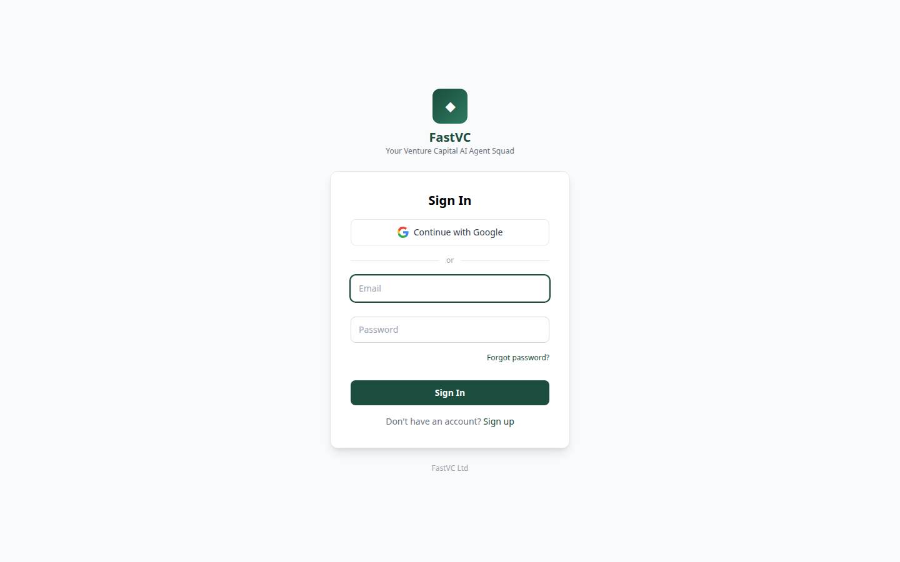

# FastVC Platform Guide

**Published:** 2026-08-19
**Platform:** [https://vc.fastsme.com](https://vc.fastsme.com)
**Source:** [github.com/predictivelabsai/FastVC](https://github.com/predictivelabsai/FastVC)

## Platform overview

FastVC is an AI workspace for venture investment teams. It adapts the proven PEHero workflow to a narrower startup-investing domain: thesis-led discovery, founder and fundraising signals, screening, round construction, diligence, investment committee, LP relations and portfolio support.

This visual guide was reviewed against the live product using Playwright. Screens and available navigation can vary by account, role, and deployment configuration.

## 1. Your Venture Capital AI Agent Squad — sourcing, round modeling, and closing the next break

AGENTIC AI FOR VENTURE CAPITAL FREE & FULLY OPEN SOURCE Your Venture Capital AI Agent Squad — sourcing, round modeling, and closing the next breakout startup. Not a prompt pack. FastVC is a working venture system for discovering startups, tracking founder and

Screen reviewed at: [https://vc.fastsme.com/](https://vc.fastsme.com/)

## 2. Everything between a thesis and a signed term sheet.

WHAT FASTVC DOES Everything between a thesis and a signed term sheet. FastVC is a working venture system, not a prompt pack. Discovery, signals, screening, round and ownership modelling, cited diligence, IC and LP work — on one data model, driven by conversati

Screen reviewed at: [https://vc.fastsme.com/features](https://vc.fastsme.com/features)

## 3. One system. Every stage. All your deal data.

PLATFORM One system. Every stage. All your deal data. FastVC lives where your deal team already works. Twenty-five specialist agents share a single model of your pipeline, your portfolio, and your market. Each agent has its own tools and prompts — and they pas

Screen reviewed at: [https://vc.fastsme.com/platform](https://vc.fastsme.com/platform)

## 4. Sign In — FastVC

◆ FastVC Your Venture Capital AI Agent Squad Sign In Continue with Google or Forgot password? Sign In Don't have an account? Sign up FastVC Ltd

Screen reviewed at: [https://vc.fastsme.com/signin](https://vc.fastsme.com/signin)

## Getting started

Visit [https://vc.fastsme.com](https://vc.fastsme.com) to explore FastVC. For source code and deployment details, use the GitHub link above.
